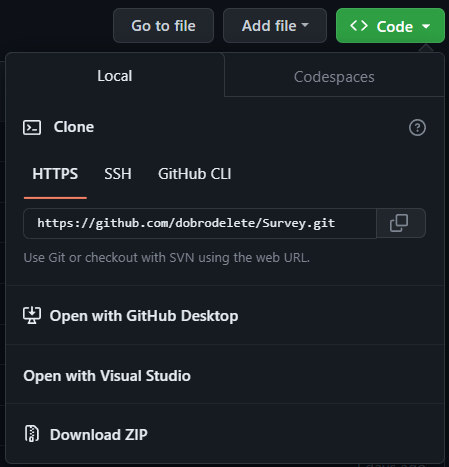

# Опросник
Данный небольшой проект создан для опроса ИОГВ (Исполнительный Орган Государственной Власти) Санкт-Петербурга.

## Установка с помощью docker compose
### Установка docker engine
#### Ubuntu
##### Add Docker's official GPG key:
```
sudo apt-get update
```
```
sudo apt-get install ca-certificates curl
```
```
sudo install -m 0755 -d /etc/apt/keyrings
```
```
sudo curl -fsSL https://download.docker.com/linux/ubuntu/gpg -o /etc/apt/keyrings/docker.asc
```
```
sudo chmod a+r /etc/apt/keyrings/docker.asc
```

##### Add the repository to Apt sources:
```
echo \  
"deb [arch=$(dpkg --print-architecture) signed-by=/etc/apt/keyrings/docker.asc] https://download.docker.com/linux/ubuntu \  
$(. /etc/os-release && echo "$VERSION_CODENAME") stable" | \  
sudo tee /etc/apt/sources.list.d/docker.list > /dev/null  
```
##### Update repository list:
```
sudo apt-get update
```
##### Install the latest version:
```
sudo apt-get install docker-ce docker-ce-cli containerd.io docker-buildx-plugin docker-compose-plugin
```

### Linux post-install steps for Docker Engine:
```
sudo groupadd docker
```
```
sudo usermod -aG docker $USER
```
##### Log out and log back in so that your group membership is re-evaluated, then run:
```
docker ps
```


## Установка и настройка вручную.
### Установка Python
#### Windows
Скачиваем Python с официального [сайта](https://www.python.org/downloads/).
После скачивания .exe мы запускаем файл и проходим самую обычную установку. Важно установить пункт "Добавить в PATH".
### Установка проекта.
Скачиваем проект. Это можно сделать прямо из github zip архивом:


После скачивания мы переходим в папку, заранее её разорхивировав.

### Запуск проекта.
При установке python должен был быть установлен установщик модулей и библиотек pip.
Нам надо открыть PowerShell или CommandPrompt (командная строка) от имени администратора, перейти в папку.

Вводим следующую команду, для того, чтобы можно было работать с виртульным окружением для проекта:

`Set-ExecutionPolicy Unrestricted`(PowerShell)

Если у вас не работает pip, то его нужно установить:

`curl https://bootstrap.pypa.io/get-pip.py -o get-pip.py`(Command Prompt)
`python get-pip.py`(Command Prompt)

#### Устанавливаем виртуальное окружение.
Устанавливаем виртуальное окружение:

`python -m pip install --user virtualenv`

Создаём виртуальное окружение:

`python -m venv venv`

После установки, в текущей директории должна была появиться папка `venv`
Если она есть, то значит что виртуальное окружение успешно было установлено. Далее нам надо запустить виртуальное окружение:

`.\venv\Scripts\activate`(Command Prompt)
`.\venv\Scripts\Activate.ps1`(PowerShell)

#### Установка модулей и библиотек.
Для установки нужных зависимостей мы запускаем следующую команду:

`pip install -r requirements.txt`

#### Настройка проекта и создание бд.
В файле `config.py` мы можем изменить настройки, в том числе логин и пароль администратора.
Админ панель пока что находится в разработке, поэтому логин и пароль носят относительных характер, но всё-таки логин и пароль важно поменять.

Для небольшой настройки и для корректной работы сайта, надо запустить следующий скрипт:

`python setup.py`

#### Запуск проекта:
Для отладки проекта и в случае возникновения багов и ошибок, в настройках (`config.py`) стоит режим отладки:
`FLASK_DEBUG = True`

Если вы не хотите, чтобы появлялись ошибки, то следует заменить `True` на `False`.

Для запуска проекта достаточно прописать:

`python main.py`

Для открытия сайта, можно перейти по адресу: `http://127.0.0.1:5000` и у вас откроется сайт, который можно посмотреть, потестировать и если что написать автору проекта свои замечания и прочее.

## Установка из архива.
Это подойдёт тем, кто не хочет делать всё руками.
Для получения актуального архива, напишите в телеграм: @dobrodelete

В этом случае надо будет только скачать python, убедиться что у вас есть pip, установить pip если потребуется, запустить виртуальное окружение и запустить сам проект.